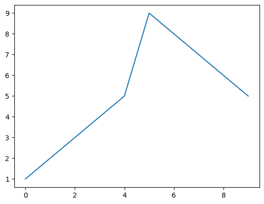

```python
import numpy as np
```


```python
Data=np.array([[101,111,112,113,141,115,116,117,118,119],[110,111,112,113,114,115,116,117,118,119],[110,111,121,131,141,151,611,711,811,119],[120,121,122,123,124,125,126,127,128,129]])

```


```python
type(Data)
```


    numpy.ndarray


```python
Data.shape
```


    (4, 10)


```python
np.__version__
```


    '1.24.3'


```python
Data
```


    array([[101, 111, 112, 113, 141, 115, 116, 117, 118, 119],
           [110, 111, 112, 113, 114, 115, 116, 117, 118, 119],
           [110, 111, 121, 131, 141, 151, 611, 711, 811, 119],
           [120, 121, 122, 123, 124, 125, 126, 127, 128, 129]])


```python
Data[2,5]
```


    151


```python
Data.ndim
```


    2


```python
Data2=np.array([101, 111, 112, 113, 141, 115, 116, 117, 118, 119],ndmin=1)              
Data2.ndim
```


    1


```python
Data2[2]+Data2[9]

```


    231


```python
np.arange(start=100,stop=205,step=5)
```


    array([100, 105, 110, 115, 120, 125, 130, 135, 140, 145, 150, 155, 160,
           165, 170, 175, 180, 185, 190, 195, 200])


```python
np.arange(5,100,5)
```


    array([ 5, 10, 15, 20, 25, 30, 35, 40, 45, 50, 55, 60, 65, 70, 75, 80, 85,
           90, 95])


```python
np.arange(10)
```


    array([0, 1, 2, 3, 4, 5, 6, 7, 8, 9])


```python
np.arange(-19,2)
```


    array([-19, -18, -17, -16, -15, -14, -13, -12, -11, -10,  -9,  -8,  -7,
            -6,  -5,  -4,  -3,  -2,  -1,   0,   1])


```python
X=np.arange(1)
print(X.dtype)

```

    int64


```python
np.sin(Data2)
```


    array([ 0.45202579, -0.86455145, -0.8899956 , -0.09718191,  0.36317137,
            0.94543533,  0.23666139, -0.68969794, -0.98195217, -0.3714041 ])


# Plot() Numpy


```python
import numpy as np
import matplotlib.pyplot as plt
```


```python
Array=np.array([1,2,3,4,5,9,8,7,6,5])
Array
```


    array([1, 2, 3, 4, 5, 9, 8, 7, 6, 5])


```python

plt.plot(Array)  
plt.show()
```


    

    


```python

```


```python

```
